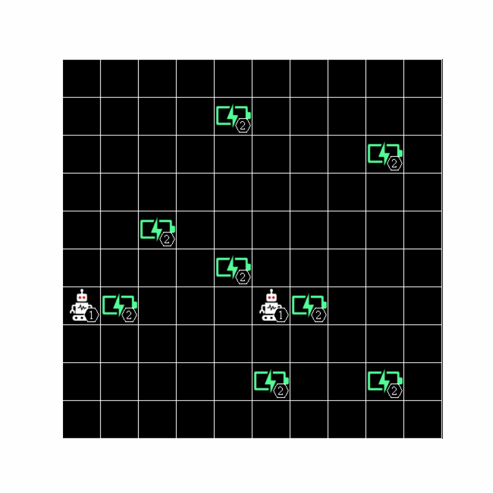
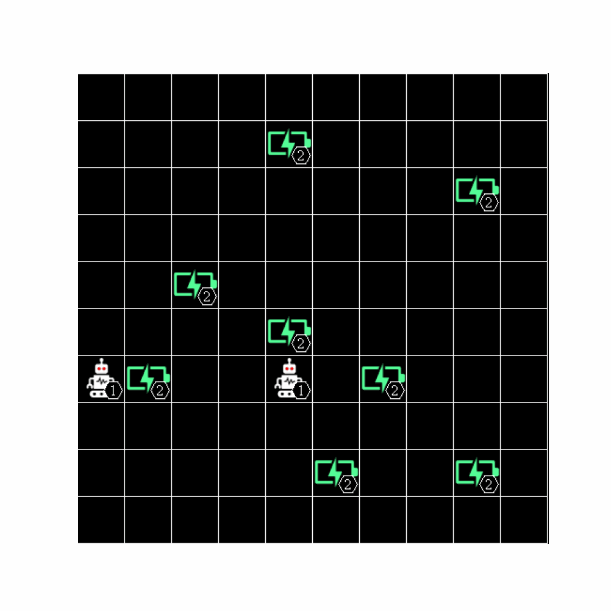

<p align="center">
 
 <p align="center">HRI-EU fork of the level-based foraging (LBF) multi-agent reinforcement learning environment</p>
</p>

<!-- TABLE OF CONTENTS -->
<h1> Table of Contents </h1>

- [About The Project](#about-the-project)
- [Getting Started](#getting-started)
  - [Installation](#installation)
- [Using the LBF environment](#using-the-lbf-environment)
  - [Action space](#action-space)
  - [Rewards](#rewards)
- [Running cooperation experiments](#running-cooperation-experiments)
  - [Reproducing experimental results from publication](#reproducing-experimental-results-from-publication)
  - [Running a series of experiments](#running-a-series-of-experiments)
  - [Available agent heuristics](#available-agent-heuristics)
  - [Collected game data](#collected-game-data)
- [Please Cite](#please-cite)
- [Contributing](#contributing)
- [Contact](#contact)
    - [Original Project:](#original-project)
    - [HRI-EU fork:](#hri-eu-fork)


<!-- ABOUT THE PROJECT -->
# About The Project

This environment is a mixed cooperative-competitive game, which focuses on the coordination of the agents involved. Agents navigate a grid world and collect food by cooperating with other agents if needed. This fork implements a new set
of heuristic agents with varying capability of cooperative behavior.

<p align="left">
 
 
</p>


Agents are placed in the grid world, and each is assigned a level. Food is also randomly scattered, each having a level on its own. Agents can navigate the environment and can attempt to collect food placed next to them. The collection of food is successful only if the sum of the levels of the agents involved in loading is equal to or higher than the level of the food. Finally, agents are awarded points equal to the level of the food they helped collect, divided by their contribution (their level). The figures below show two states of the game, one that requires cooperation, and one more competitive.

While it may appear simple, this is a very challenging environment, requiring the cooperation of multiple agents while being competitive at the same time. In addition, the discount factor also necessitates speed for the maximisation of rewards. Each agent is only awarded points if it participates in the collection of food, and it has to balance between collecting low-levelled food on his own or cooperating in acquiring higher rewards. In situations with three or more agents, highly strategic decisions can be required, involving agents needing to choose with whom to cooperate. Another significant difficulty for RL algorithms is the sparsity of rewards, which causes slower learning.

This is a Python simulator for level based foraging. It is based on OpenAI's RL framework, with modifications for the multi-agent domain. The efficient implementation allows for thousands of simulation steps per second on a single thread, while the rendering capabilities allows humans to visualise agent actions. Our implementation can support different grid sizes or agent/food count. Also, game variants are implemented, such as cooperative mode (agents always need to cooperate) and shared reward (all agents always get the same reward), which is attractive as a credit assignment problem.

This fork allows to control the degree of required cooperation in the environment by setting the level of a specified
fraction of food items such that the item can only be collected by two agents jointly. A further parameter can introduce
distractor items, i.e., food that can neither be collected individually or by both agents jointly. Additionally, the
fork implements agent heuristics of varying cooperative ability, ranging from agents behaving randomly or purely
egoistic to purely cooperative. See the below [section on cooperation experiments](#running-cooperation-experiments) for
details.


<!-- GETTING STARTED -->
# Getting Started

## Installation

Install using pip
```sh
pip install lbforaging
```
Or to ensure that you have the latest version:
```sh
git clone https://github.com/semitable/lb-foraging.git
cd lb-foraging
pip install -e .
```


<!-- USAGE EXAMPLES -->
# Using the LBF environment

For an example on how to run the environment call

```bash
python lbf_heuristic_agents.py
```

in the `experiments` folder. This will start one game episode using a heuristic
agent, specified in `config/settings.yml`.

Create environments with the gym framework.
First import
```python
import lbforaging
```

Then create an environment:
```python
env = gym.make("Foraging-8x8-2p-1f-v2")
```

We offer a variety of environments using this template:
```
"Foraging-{GRID_SIZE}x{GRID_SIZE}-{PLAYER COUNT}p-{FOOD LOCATIONS}f{-coop IF COOPERATIVE MODE}-v0"
```

But you can register your own variation using (change parameters as needed):
```python
from gym.envs.registration register

register(
    id="Foraging-{0}x{0}-{1}p-{2}f{3}-v2".format(s, p, f, "-coop" if c else ""),
    entry_point="lbforaging.foraging:ForagingEnv",
    kwargs={
        "players": p,
        "field_size": (s, s),
        "max_food": f,
        "sight": s,
        "max_episode_steps": 50,
        "force_coop": c,
    },
)
```

Similarly to Gym, but adapted to multi-agent settings step() function is defined as
```python
nobs, nreward, ndone, ninfo = env.step(actions)
```

Where n-obs, n-rewards, n-done and n-info are LISTS of N items (where N is the number of agents). The i'th element of each list should be assigned to the i'th agent.


## Action space

actions is a LIST of N INTEGERS (one of each agent) that should be executed in that step. The integers should correspond to the Enum below:

```python
class Action(Enum):
    NONE = 0
    NORTH = 1
    SOUTH = 2
    WEST = 3
    EAST = 4
    LOAD = 5
```
Valid actions can always be sampled like in a gym environment, using:
```python
env.action_space.sample() # [2, 3, 0, 1]
```
Also, ALL actions are valid. If an agent cannot move to a location or load, his action will be replaced with `NONE` automatically.

## Rewards

The rewards are calculated as follows. When one or more agents load a food, the food level is rewarded to the agents weighted with the level of each agent. Then the reward is normalised so that at the end, the sum of the rewards (if all foods have been picked-up) is one.
If you prefer code:

```python
for a in adj_players: # the players that participated in loading the food
    a.reward = float(a.level * food) # higher-leveled agents contribute more and are rewarded more.
    if self._normalize_reward:
        a.reward = a.reward / float(
            adj_player_level * self._food_spawned
        )  # normalize reward so that the final sum of rewards is one.
```

# Running cooperation experiments

## Reproducing experimental results from publication

To reproduce experiments that were used to generate results shown in the
accompanying publication, in the `experiments` folder run

```bash
./run_experiments_for_paper.sh
```

## Running a series of experiments

This fork provides additional code to run experiments in the LBF environment using
agents of different cooperative abilities and environments that require different
degrees of cooperation. The required degree of cooperation is specified by the fraction
of food items that can only be collected jointly by both agents, $c$.

In the `experiments` folder run

```bash
python run_experiments.py --settings ../config/settings.yml --outpath "../lbf_experiments/"
```

The settings file, `config/settings.yml` specifies the experimental setup. It can contain the following options

`experiment`:
- `heuristics`: list of agent to be heuristics used (see next section), currently only agents with the same heuristic can be paired
- `coop_min`, `coop_max`, `coop_step`: defines different degrees of required cooperation in an environment, required degree of cooperation is defined as the fraction of food items $c$ that can only be collected jointly
- `ntrials`: number of trials per combination of heuristic and $c$

`environment`:
- `size`: edge length of grid world
- `sight`: agent sight, if `sight`==`size`, agents can see the whole environment
- `nplayers`: number of agents
- `nfood`: number of food items
- `thresh_respawn_food`: number of remaining food items on the field that trigger the pawning of new food items, if -1, no respawn
- `distractors`: fraction of distractors at initialization, distractors are items that can not even be picked up jointly by both agents
- `max_episode_steps`: maximum number of steps after which an episode is terminated if respawning is selected

`agents`:
- `patience`: number of maximum loading attempts by an agent before disregarding a target
- `memory`: number of steps remembered by an agent
- `levels`: levels of each agent, e.g., [1, 1]
- `heuristic`: agent heuristic, can be  `H1`, `H2`, `H3`, `H4`, `H5` for heuristics described in [Albrecht, S. V., & Ramamoorthy, S., 2015, arXiv preprint](https://arxiv.org/abs/1506.01170), `MultiHeuristicAgent` for heuristic specified by a set of abilities
- `abilities`: abilities of `MultiHeuristicAgent`, not used if heuristics `H1`-`H4` are chosen

By settings `thresh_respawn_food` to a value greater 0, new food items are spawned if
when only the specified number of items remains on the field. This setting allows to run
episodes for an arbitrary number of steps, specified in `max_episode_steps` (if no new
food is spawned, the episode terminates when all items are collected).

## Available agent heuristics

The repository contains agent heuristics `H1`-`H4` described in the original publication by Albrecht and Ramamoorthy ([Albrecht, S. V., & Ramamoorthy, S., 2015, arXiv preprint](https://arxiv.org/abs/1506.01170)).

This fork additionally implements the `MultiHeuristicAgent` class that allows to define agent behavior by specifying a
set of abilities. Based on this class, a set of heuristics is specified using sets ob abilities defined in
`experiments/mh_agent_configurations`:

- `BASELINE`: takes random steps, attempts to load if next to a food item (shows behavior similar to former `Random` agent)
- `EGOISTIC`: takes steps towards the closest goal compatible with own level (former `H1`)
- `SOCIAL1`: takes steps towards goal closest to Euclidean center of all agents, irrespective of goal level (former `H2`)
- `SOCIAL2`: takes steps towards goal closest to Euclidean center of all agents and with compatible level (former `H4`)
- `COOPERATIVE`: uses a goal value function, to choose a goal it can collect jointly with the second agent (similar behavior to `SOCIAL2`)
- `ADAPTIVE`: uses a goal value function to decide whether to act cooperatively or egoistically

The goal value function assigns a value to every food item within an agent's sight. The value is calculated by the items level/value divided by the distance between the agent and the item. If an item can only be collected jointly, its value is divided by the number of agents jointly collecting it (2).

## Collected game data

When running LBF experiments via

```bash
python run_experiments.py --settings ../config/settings.yml --outpath "../lbf_experiments/"
```

the generated game data is saved to the specified folder as a csv. Saved game data comprises the following variables for
later analysis:

- `agent_id`: agent ID, agent actions are concatenated
- `step`: episode iterations the data is collected for
- `coord_x`: agent's x-coordinate
- `coord_y`: agent's y-coordinate
- `reward`: environment reward
- `reward_sum`: cumulative environment reward
- `cooperative_actions`: whether a cooperative action was performed in this step (joint collection of food item)
- `food`: agent's share of the value of collected food item, 0 if nothing was collected
- `food_type`: whether collected food item required cooperation or not
- `food_sum`: cumulative food value
- `action`: agent's action
- `goal_value_ego`: highest value of a goal the agent could have collected individually
- `goal_value_other`: highest value of a goal the other agent could have collected individually
- `goal_value_together`: highest value of a goal the agent's could have collected jointly
- `dist_closest_food`: distance to closest food item
- `dist_closest_agent`: distance to closest agent

<!-- CITATION -->
# Please Cite
1. The paper that first uses this implementation of Level-based Foraging (LBF) and achieves state-of-the-art results:
```
@inproceedings{christianos2020shared,
  title={Shared Experience Actor-Critic for Multi-Agent Reinforcement Learning},
  author={Christianos, Filippos and Schäfer, Lukas and Albrecht, Stefano V},
  booktitle = {Advances in Neural Information Processing Systems (NeurIPS)},
  year={2020}
}
```
2. A comperative evaluation of cooperative MARL algorithms and includes an introduction to this environment:
```
@inproceedings{papoudakis2021benchmarking,
   title={Benchmarking Multi-Agent Deep Reinforcement Learning Algorithms in Cooperative Tasks},
   author={Georgios Papoudakis and Filippos Christianos and Lukas Schäfer and Stefano V. Albrecht},
   booktitle = {Proceedings of the Neural Information Processing Systems Track on Datasets and Benchmarks (NeurIPS)},
   year={2021},
   openreview = {https://openreview.net/forum?id=cIrPX-Sn5n},
}
```

<!-- CONTRIBUTING -->
# Contributing

1. Fork the Project
2. Create your Feature Branch (`git checkout -b feature/AmazingFeature`)
3. Commit your Changes (`git commit -m 'Add some AmazingFeature`)
4. Push to the Branch (`git push origin feature/AmazingFeature`)
5. Open a Pull Request


<!-- CONTACT -->
# Contact

### Original Project:

Filippos Christianos - f.christianos@ed.ac.uk

Project Link: [https://github.com/semitable/lb-foraging](https://github.com/semitable/lb-foraging)

### HRI-EU fork:

Patricia Wollstadt - patricia.wollstadt@honda-ri.de \
Christiane Wiebel-Herboth - christiane.wiebel@honda-ri.de \
Matti Krüger - matti.krueger@honda-ri.de
